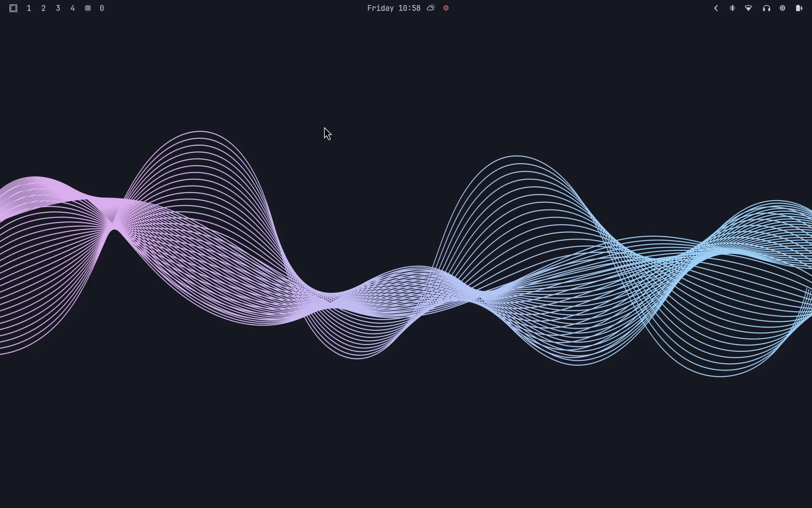

# hyprwheel

GTA5-style radial app launcher for [Hyprland](https://hypr.land). Right-click
on an empty spot of your desktop and a wheel pops up under your cursor —
pick a slice to launch your browser, terminal, file manager, or anything else.

- Single Python file, no daemon, no build step
- Opens **only** when the cursor is over empty desktop (windows and bars keep
  their normal right-click)
- App fallback chains: the first installed candidate wins, so one config works
  across machines (`alacritty` → `kitty` → `foot` → …)
- Missing apps show as dimmed slices
- Right-click again or press `Esc` to close

## Demo

[](hyprwheel.mp4)

## Requirements

- Hyprland ≥ 0.41 (for the `bindn` non-consuming bind flag)
- GTK3, gtk-layer-shell, PyGObject, pycairo — available on virtually every distro:

| Distro | Command |
|---|---|
| Arch | `sudo pacman -S --needed gtk3 gtk-layer-shell python-gobject python-cairo` |
| Fedora | `sudo dnf install gtk3 gtk-layer-shell python3-gobject python3-cairo` |
| Ubuntu / Debian | `sudo apt install gir1.2-gtk-3.0 gir1.2-gtklayershell-0.1 python3-gi python3-gi-cairo` |
| openSUSE | `sudo zypper install gtk3 gtk-layer-shell python3-gobject python3-cairo` |

## Install

```sh
git clone https://github.com/YOURUSER/hyprwheel
cd hyprwheel
./install.sh
```

The installer checks dependencies, copies `hyprwheel` to `~/.local/bin`,
seeds `~/.config/hyprwheel/config.json`, and offers to add the right-click
bind to `~/.config/hypr/bindings.conf` for you (then reloads Hyprland).

> `~/.local/bin` must be on your `$PATH` (it is on most setups).

Or manually: copy `hyprwheel` somewhere on your `$PATH` and add to your
Hyprland config:

```
bindn = , mouse:273, exec, hyprwheel --desktop
```

`bindn` is non-consuming: the right-click still reaches windows normally.
`--desktop` makes hyprwheel exit silently unless the cursor is over an empty
part of the desktop — so the wheel only ever appears on your wallpaper.

You can also bind it to anything else, e.g. a key:

```
bind = SUPER, grave, exec, hyprwheel
```

(without `--desktop` it opens unconditionally, wherever the cursor is)

## Configure

Edit `~/.config/hyprwheel/config.json` (see `config.example.json`):

```json
{
  "outer_radius": 220,
  "inner_radius": 70,
  "items": [
    { "label": "Terminal", "icon": "💻",
      "exec": ["xdg-terminal-exec", "$TERMINAL", "alacritty", "kitty"] },
    { "label": "YouTube", "icon": "▶",
      "exec": ["xdg-open https://youtube.com"] }
  ]
}
```

- `exec` is a fallback chain: the first entry whose binary exists is used.
  Entries can include arguments and URLs (`xdg-open https://…`).
- `$TERMINAL`-style env vars are expanded; unset vars are skipped.
- Any number of slices works — the wheel divides itself evenly.
- Icons are just text: emoji, Nerd Font glyphs, or plain letters.

## Troubleshooting

- **Wheel never appears** — run `hyprwheel` in a terminal: import errors mean a
  missing dependency (see Requirements). If it opens there but not on
  right-click, run `hyprctl configerrors` and check the bind line exists.
- **Wheel appears over windows** — make sure the bind uses `--desktop`.
- **A slice is dimmed** — none of its `exec` candidates are installed; edit
  `~/.config/hyprwheel/config.json`.
- **Right-click stopped working in apps** — it can't: `bindn` passes clicks
  through. If it did, your bind uses `bind` instead of `bindn`.

## Uninstall

```sh
rm ~/.local/bin/hyprwheel
rm -r ~/.config/hyprwheel
```

Then remove the `hyprwheel` lines from `~/.config/hypr/bindings.conf`.

## How it works

One GTK3 window on a `wlr-layer-shell` overlay, wheel drawn with Cairo at the
cursor position. `--desktop` asks `hyprctl` whether the cursor overlaps any
mapped window or top/overlay layer surface (bars, notifications) and bails out
if so. Launching a second instance while the wheel is open closes it (toggle).

## License

MIT
